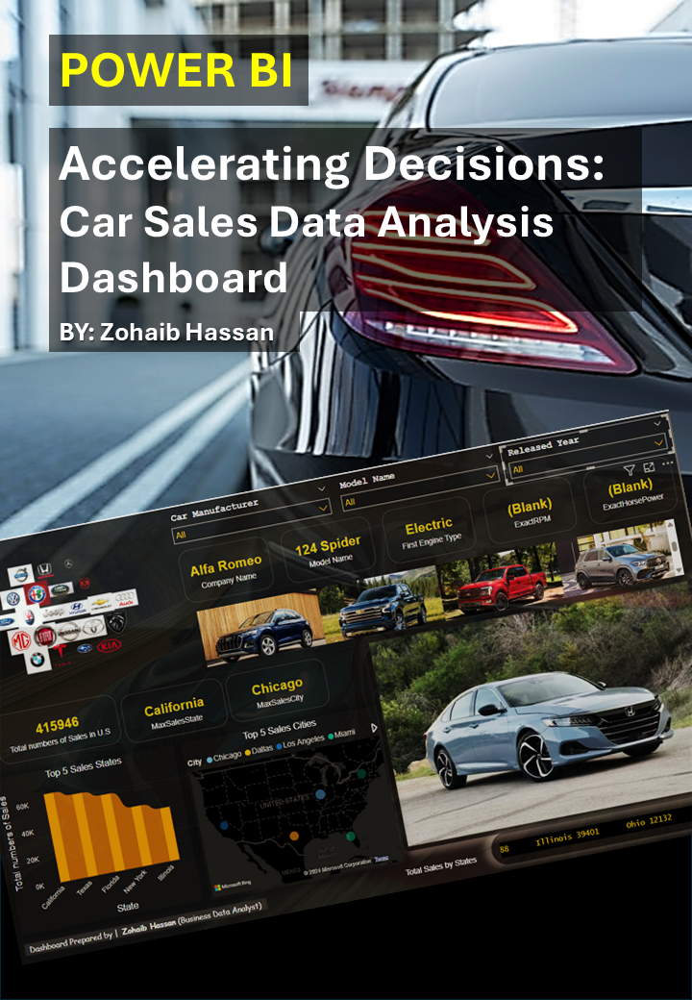

# Car-Sales-Dashboard-PowerBi-Project
Welcome to the **Car Sales Dashboard - Power BI Project** repository. This repository contains all the necessary files and resources to understand and analyze car sales data using Power BI.

## Project Overview
This project involves creating a comprehensive dashboard to analyze car sales data using Power BI. Detailed information about the project can be found in the `Project Detail.pdf` file.

## Files Included
- **Project Detail.pdf**: Contains all the details of the project.
- **Dataset file**: The data used for this project. Use the passcode `332211` to access the dataset.
- **Project Screenshot file**: Contains screenshots showcasing various aspects of the project.

## Dataset Information
The dataset includes car sales data. To access the dataset, use the passcode `332211`.

## Project Screenshots
The `Project Screenshot file` contains images that show different parts of the project and the Power BI dashboard.

## Project Video
Watch the project video on YouTube: [Car Sales Dashboard Video](https://youtu.be/js6LWgVLGcg).

## FeedBack
If you have any feedback, suggestions, or questions about these projects, feel free to open an issue or reach out to me directly.

## Copyright Notice: 

All projects and content in this repository are the intellectual property of Zohaib Hassan. You are welcome to view, fork, and modify the code for personal or educational purposes. However, any commercial use or distribution of these projects, either in part or in whole, without explicit permission from the author, is strictly prohibited.

If you need access to the complete dashboard or have any questions, feel free to contact me via email or connect with me on LinkedIn.

For commercial usage or distribution permissions, please contact me at zohaib.atd92@gmail.com for licensing inquiries.

Thank you for respecting the author's rights and intellectual property.

Author: Zohaib Hassan
